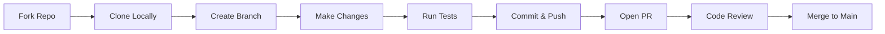

# 📚 Shelf Care

> **An Online Library Platform** — Borrow from thousands of titles. From timeless classics to modern bestsellers — your next story is waiting.

<div align="center">

[](https://shelf-care.vercel.app/)
[](https://github.com/rj-roy/shelf-care)
[](https://github.com/rj-roy/shelf-care-jsr)
[](https://nextjs.org/)
[](LICENSE)

</div>

---

## 📋 Table of Contents

- [✨ Features](#-features)
- [🖼️ Screenshots](#️-screenshots)
- [🛠️ Tech Stack](#️-tech-stack)
- [📦 Project Structure](#-project-structure)
- [🚀 Getting Started](#-getting-started)
- [🔧 Environment Variables](#-environment-variables)
- [📡 API Endpoints](#-api-endpoints)
- [🧪 Testing](#-testing)
- [🤝 Contributing](#-contributing)
- [👨‍💻 Author](#-author)
- [📄 License](#-license)

---

## ✨ Features

### 🔐 User Authentication
- Secure sign-up & login with **BetterAuth**
- Protected routes for authenticated users
- Session management & role-based access

### 📖 Book Management
- Browse **12,400+ books** across **40+ genres**
- Advanced search & filtering by title, author, category
- Book details page with availability status & copy count
- Category tags: Story, Tech, Science, History, and more

### 🎯 Core Functionality
- **Borrow & Return System**: Track borrowed books with due dates
- **Wishlist**: Save books to read later
- **Reading History**: View your borrowing history
- **Availability Check**: Real-time copy availability

### 👥 Community Features
- **Reading Clubs**: Join themed groups (Fiction Fridays, Science & Wonder, etc.)
- **Member Profiles**: Connect with fellow readers
- **Reviews & Ratings**: Share your thoughts on books

### 🎨 UI/UX
- Fully responsive design (Mobile • Tablet • Desktop)
- Dark/Light mode support
- Smooth animations with Framer Motion
- Accessible components (WCAG compliant)

### ⚡ Performance
- Server-side rendering (SSR) & Static generation (SSG)
- Optimized images with Next.js Image component
- Lazy loading for book lists & covers
- API route caching for faster responses

---

## 🖼️ Screenshots

<div align="center">

| Home Page | Book Details | Reading Clubs |
|-----------|-------------|---------------|
|  |  |  |

| Dashboard | Mobile View |
|-----------|-------------|
|  |  |

</div>

> 💡 *Screenshots are placeholders. Visit [Live Demo](https://shelf-care.vercel.app/) for real previews.*

---

## 🛠️ Tech Stack

### Frontend (Client)
| Technology | Purpose |
|------------|---------|
| **Next.js 14** | React framework with App Router |
| **React 18** | UI library with hooks & concurrent features |
| **Tailwind CSS** | Utility-first styling |
| **Framer Motion** | Smooth animations & transitions |
| **React Icons** | Icon library (Fa, Hi, etc.) |
| **Zustand** | Lightweight state management |
| **React Hook Form** | Form handling with validation |

### Backend (Server)
| Technology | Purpose |
|------------|---------|
| **Node.js + Express** | REST API server |
| **JSON Server** | Lightweight mock API (development) |
| **MongoDB** | Primary database (production-ready) |
| **BetterAuth** | Authentication & session management |
| **CORS / Helmet** | Security middleware |

### DevOps & Tools
| Tool | Purpose |
|------|---------|
| **Vercel** | Frontend deployment & CI/CD |
| **GitHub Actions** | Automated testing & deployment |
| **ESLint + Prettier** | Code quality & formatting |
| **Git** | Version control |

---

## 📦 Project Structure

### 🗂️ Client (`/shelf-care`)
```
shelf-care/
├── app/
│   ├── (auth)/
│   │   ├── login/page.jsx
│   │   └── register/page.jsx
│   ├── books/
│   │   ├── [slug]/page.jsx    # Book details
│   │   └── page.jsx           # Book listing
│   ├── clubs/
│   │   └── page.jsx           # Reading clubs
│   ├── dashboard/
│   │   └── page.jsx           # User dashboard
│   ├── layout.jsx             # Root layout
│   └── page.jsx               # Home page
├── components/
│   ├── ui/                    # Reusable UI components
│   ├── books/                 # Book-specific components
│   ├── layout/                # Header, Footer, Navigation
│   └── animations/            # Framer Motion wrappers
├── lib/
│   ├── api.js                 # API client utilities
│   ├── auth.js                # Auth helpers
│   └── utils.js               # Helper functions
├── hooks/                     # Custom React hooks
├── styles/
│   └── globals.css            # Global Tailwind styles
├── public/                    # Static assets
├── .env.local                 # Environment variables
├── next.config.mjs            # Next.js config
├── tailwind.config.js         # Tailwind config
└── package.json
```

### 🗂️ Server (`/shelf-care-jsr`)
```
shelf-care-jsr/
├── routes/
│   ├── auth.js                # Authentication routes
│   ├── books.js               # Book CRUD operations
│   ├── clubs.js               # Reading clubs API
│   └── users.js               # User profile management
├── middleware/
│   ├── auth.js                # Auth verification
│   └── errorHandler.js        # Global error handling
├── config/
│   ├── db.js                  # Database connection
│   └── constants.js           # App constants
├── utils/
│   └── helpers.js             # Utility functions
├── db.json                    # Mock data (development)
├── server.js                  # Express entry point
├── .env                       # Server environment variables
└── package.json
```

---

## 🚀 Getting Started

### Prerequisites
- Node.js 18+ 
- npm or yarn
- MongoDB (for production) or use mock JSON server

### 🔧 Installation

#### 1. Clone Repositories
```bash
# Clone client
git clone https://github.com/rj-roy/shelf-care.git
cd shelf-care

# Clone server (in separate terminal or sibling directory)
git clone https://github.com/rj-roy/shelf-care-jsr.git
```

#### 2. Setup Client
```bash
cd shelf-care
npm install

# Copy environment example
cp .env.example .env.local

# Start development server
npm run dev
# → http://localhost:3000
```

#### 3. Setup Server
```bash
cd shelf-care-jsr
npm install

# Copy environment example
cp .env.example .env

# Start mock server (development)
npm run dev
# → http://localhost:5000

# OR start with MongoDB (production)
npm start
```

#### 4. Verify Connection
- Client: `http://localhost:3000`
- Server API: `http://localhost:5000/api/health`

---

## 🔧 Environment Variables

### Client (`.env.local`)
```env
# API Configuration
NEXT_PUBLIC_API_URL=http://localhost:5000/api

# Authentication
NEXT_PUBLIC_BETTERAUTH_URL=http://localhost:5000

# App Configuration
NEXT_PUBLIC_APP_URL=http://localhost:3000
NEXT_PUBLIC_SITE_NAME=Shelf Care
```

### Server (`.env`)
```env
# Server
PORT=5000
NODE_ENV=development

# Database (MongoDB)
MONGODB_URI=mongodb://localhost:27017/shelf-care
# OR for mock mode:
USE_MOCK=true

# Authentication
BETTERAUTH_SECRET=your-super-secret-key-change-in-production
BETTERAUTH_TRUSTED_ORIGINS=http://localhost:3000

# CORS
CORS_ORIGIN=http://localhost:3000
```

> ⚠️ **Never commit `.env` files**. Add them to `.gitignore`.

---

## 📡 API Endpoints

### Authentication
| Method | Endpoint | Description | Auth Required |
|--------|----------|-------------|--------------|
| `POST` | `/api/auth/register` | Create new user account | ❌ |
| `POST` | `/api/auth/login` | User login | ❌ |
| `POST` | `/api/auth/logout` | End session | ✅ |
| `GET`  | `/api/auth/me` | Get current user profile | ✅ |

### Books
| Method | Endpoint | Description | Auth Required |
|--------|----------|-------------|--------------|
| `GET`  | `/api/books` | List all books (with pagination & filters) | ❌ |
| `GET`  | `/api/books/:slug` | Get single book details | ❌ |
| `GET`  | `/api/books/search?q=...` | Search books by query | ❌ |
| `POST` | `/api/books/:id/borrow` | Borrow a book | ✅ |
| `POST` | `/api/books/:id/return` | Return a book | ✅ |
| `POST` | `/api/books/:id/wishlist` | Add to wishlist | ✅ |

### Reading Clubs
| Method | Endpoint | Description | Auth Required |
|--------|----------|-------------|--------------|
| `GET`  | `/api/clubs` | List all reading clubs | ❌ |
| `GET`  | `/api/clubs/:id` | Get club details & members | ❌ |
| `POST` | `/api/clubs/:id/join` | Join a reading club | ✅ |
| `POST` | `/api/clubs` | Create new club | ✅ |

### User Dashboard
| Method | Endpoint | Description | Auth Required |
|--------|----------|-------------|--------------|
| `GET`  | `/api/users/me/borrowed` | Get user's borrowed books | ✅ |
| `GET`  | `/api/users/me/wishlist` | Get user's wishlist | ✅ |
| `GET`  | `/api/users/me/history` | Get borrowing history | ✅ |

---

## 🧪 Testing

### Client Tests
```bash
# Run unit tests (Jest + React Testing Library)
npm run test

# Run with coverage
npm run test:coverage

# E2E tests (Playwright)
npm run test:e2e
```

### Server Tests
```bash
# Run API tests (Supertest + Jest)
npm run test

# Test with coverage
npm run test:coverage
```

### Linting & Formatting
```bash
# Check code quality
npm run lint

# Auto-fix issues
npm run lint:fix

# Format code
npm run format
```

---

## 🤝 Contributing

Contributions are welcome! Here's how to get started:

1. **Fork** the repository
2. **Create** your feature branch: `git checkout -b feature/amazing-feature`
3. **Commit** your changes: `git commit -m 'feat: add amazing feature'`
4. **Push** to the branch: `git push origin feature/amazing-feature`
5. **Open** a Pull Request

### Contribution Guidelines
- Follow the [Conventional Commits](https://www.conventionalcommits.org/) specification
- Write clear, descriptive commit messages
- Add tests for new features
- Update documentation as needed
- Ensure all tests pass before submitting

### Development Workflow


---

## 👨‍💻 Author

**Jibon Roy**  
🔗 [Portfolio](https://jibonroy.me) | 💼 [LinkedIn](https://linkedin.com/in/roy-jibon) | 🐙 [GitHub](https://github.com/rj-roy)

> Passionate about creating intuitive and engaging user experiences. Specialize in transforming ideas into beautifully crafted products.

<div align="center">

[](https://github.com/rj-roy)
[](https://linkedin.com/in/roy-jibon)
[](mailto:jibonroy.me@gmail.com)

</div>

---

## 📄 License

Distributed under the **MIT License**. See [`LICENSE`](LICENSE) for more information.

```
MIT License

Copyright (c) 2026 Jibon Roy

Permission is hereby granted, free of charge, to any person obtaining a copy
of this software and associated documentation files (the "Software"), to deal
in the Software without restriction, including without limitation the rights
to use, copy, modify, merge, publish, distribute, sublicense, and/or sell
copies of the Software, and to permit persons to whom the Software is
furnished to do so, subject to the following conditions:

The above copyright notice and this permission notice shall be included in all
copies or substantial portions of the Software.

THE SOFTWARE IS PROVIDED "AS IS", WITHOUT WARRANTY OF ANY KIND, EXPRESS OR
IMPLIED, INCLUDING BUT NOT LIMITED TO THE WARRANTIES OF MERCHANTABILITY,
FITNESS FOR A PARTICULAR PURPOSE AND NONINFRINGEMENT. IN NO EVENT SHALL THE
AUTHORS OR COPYRIGHT HOLDERS BE LIABLE FOR ANY CLAIM, DAMAGES OR OTHER
LIABILITY, WHETHER IN AN ACTION OF CONTRACT, TORT OR OTHERWISE, ARISING FROM,
OUT OF OR IN CONNECTION WITH THE SOFTWARE OR THE USE OR OTHER DEALINGS IN THE
SOFTWARE.
```

---

<div align="center">

**⭐ If you find this project helpful, please give it a star on GitHub!**

Made with ❤️ by [Jibon Roy](https://github.com/rj-roy)

</div>
